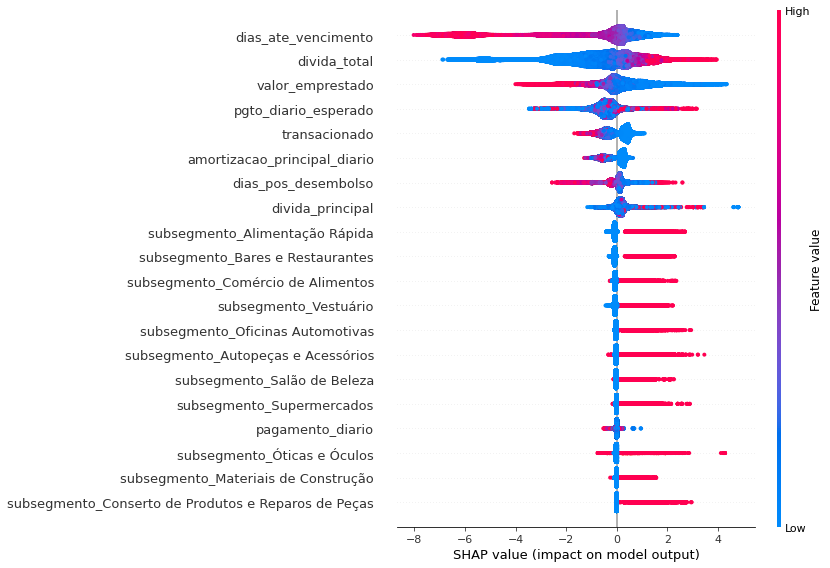

# Stone Data Challenge

O case do Data Challenge da Stone se trata sobre estimar a probabilidade de fault (PD) de uma base de clientes da Stone. Essa é uma informação crucial para determinar se podemos ou não conceder crédito para um cliente e para que a Stone tome decisões sobre limite, taxa de juros etc. Este projeto é dividido em 4 partes: Manipulação dos dados e feature engineering, Visualização dos dados, Modelo final e Explicação dos resultados. 

Dentro dessas etapas, algumas variáveis foram removidas, outras foram criadas e funções de visualização também foram implementadas, permitindo que pudessemos entender quais subsegmentos possuem maiores clientes, risco de inadimplência, distribuição das variáveis etc, como podemos ver abaixo:

### Subsegmento (categórica)

### Valor emprestago (numérica)

### Pagamento diário (numérica)

### Divida total (numérica)

## Técnicas utilizadas
Posteriormente, uma série de modelos foram testados como SVC, XGBoost, DecisionTree e RandomForest. Além disso, técnicas para lidar com dados desbalanceados como a SMOTE foram utilizadas e os hiperparâmetros também foram tunados, até chegarmos ao melhor modelo, como pode ser observado na tabela abaixo.

| Modelo       | AUC           | Recall  |
| ------------- |:-------------:| -----:|
| RandomForest SMOTE      | 76% | 85% |
| RandomForest SMORE + Undersampling      | 75%      |   80% |
| XGBoost |  75% | 74% |
| XGBoost SMOTE | 65% | 88%|
| **RandomForest** | **82%** |**80%**|

Além disso, utilizei o SHAP (SHapley Additive exPlanations) para identificar a importância de cada uma das features nos modelos. Todos sabemos que utilizar a `feature_importance` é extremamente *tricky*, até porque a definição de ganho de informação ou peso pode nos fornecer valores pouco confiáveis. É importante ressaltar que os valores de SHAP não fornecem causalidade, o que torna nossa análise ideal. Os resultados são mostrados abaixo:

Desta análise, percebemos que algumas variáveis possuem um impacto relevante na saída do nosso modelo, como era de se esperar. Entre elas: valores baixos de `dias_ate_vencimento` e valores altos de `divida_total`. Ou seja, pessoas com dívidas totais altas a poucos dias do vencimento, tendem a ter um impacto maior na predição. Porém, algumas outras informações não são tão lógicas, como os subsegmentos. Observa-se que quando o subsegmento era "Alimentação rápida", "Bares e Restaurantes", "Comércio de alimentos", "Vestuário", "Oficinas automotivas", "Autopeças", "Salão de beleza" ou "Supermercados", o impacto no modelo também era maior. Talvez seja interessante ter sistemas de segurança extras quando a pessoa a requerer o crédito for de algum destes segmentos. 
