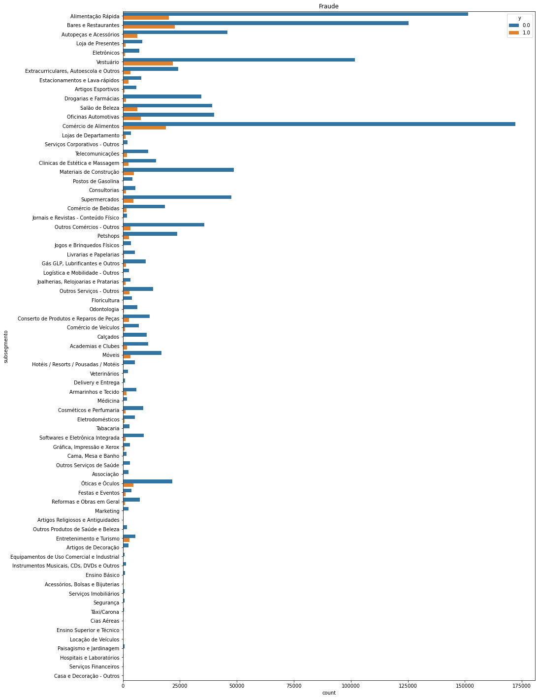
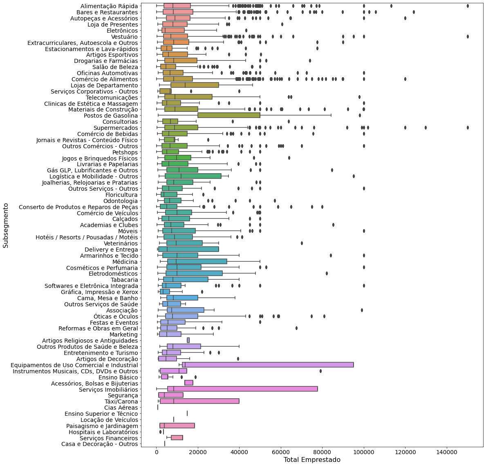
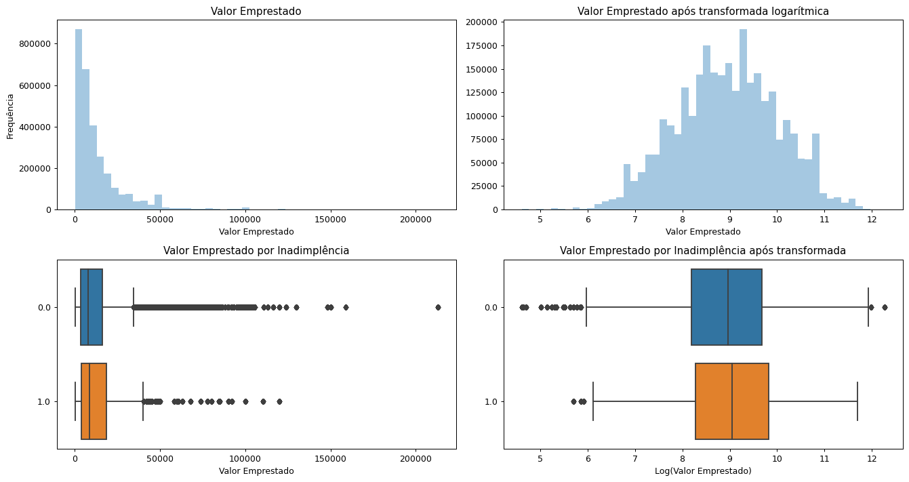
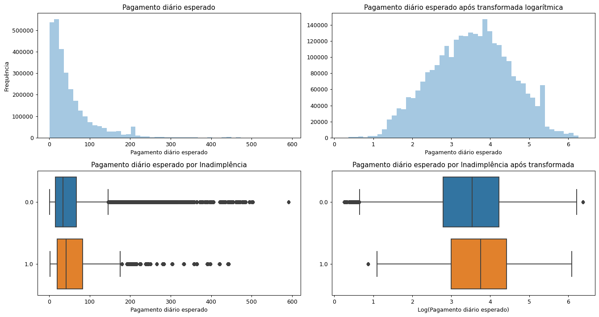
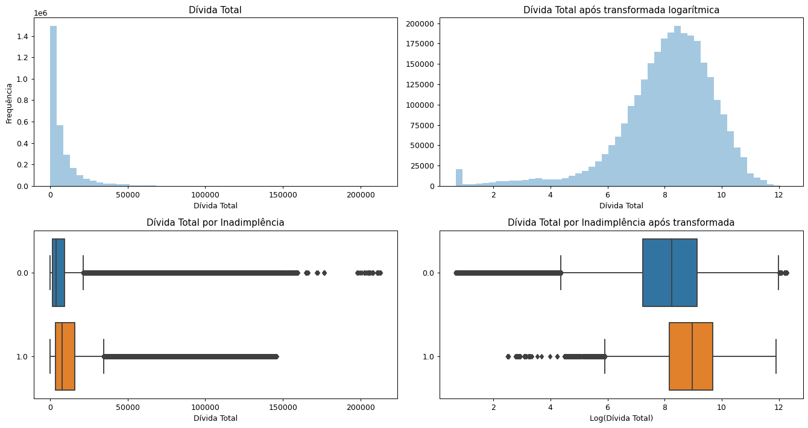

# Stone Data Challenge

O case do Data Challenge da Stone se trata sobre estimar a probabilidade de fault (PD) de uma base de clientes da Stone. Essa é uma informação crucial para determinar se podemos ou não conceder crédito para um cliente e para que a Stone tome decisões sobre limite, taxa de juros etc. Este projeto é dividido em 4 partes: Manipulação dos dados e feature engineering, Visualização dos dados, Modelo final e Explicação dos resultados. 

Dentro dessas etapas, algumas variáveis foram removidas, outras foram criadas e funções de visualização também foram implementadas, permitindo que pudessemos entender quais subsegmentos possuem maiores clientes, risco de inadimplência, distribuição das variáveis etc, como podemos ver abaixo:

### Subsegmento (categórica)

### Subsegmento (categórica)

Posteriormente, uma série de modelos foram testados como SVC, XGBoost, DecisionTree e RandomForest. Além disso, técnicas para lidar com dados desbalanceados como a SMOTE foram utilizadas e os hiperparâmetros também foram tunados, até chegarmos ao melhor modelo, como pode ser observado na tabela abaixo.

| Modelo       | AUC           | Recall  |
| ------------- |:-------------:| -----:|
| RandomForest SMOTE      | 76% | 85% |
| RandomForest SMORE + Undersampling      | 75%      |   80% |
| XGBoost |  75% | 74% |
| XGBoost SMOTE | 65% | 88%|
| **RandomForest** | **82%** |**80%**|
